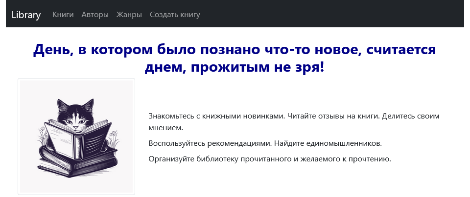

# UI for Library Rest Api

## Start page


### Возможности
* Начальная страница 
* Получение списка жанров, авторов, книг, комментариев конкретной книги
* Создание, редактирование и удаление книги, комментария

### How to run:

Выполнить команду:
```shell
vue-cli-service serve
```

Открыть страницу в браузере:  
http://localhost:8081/